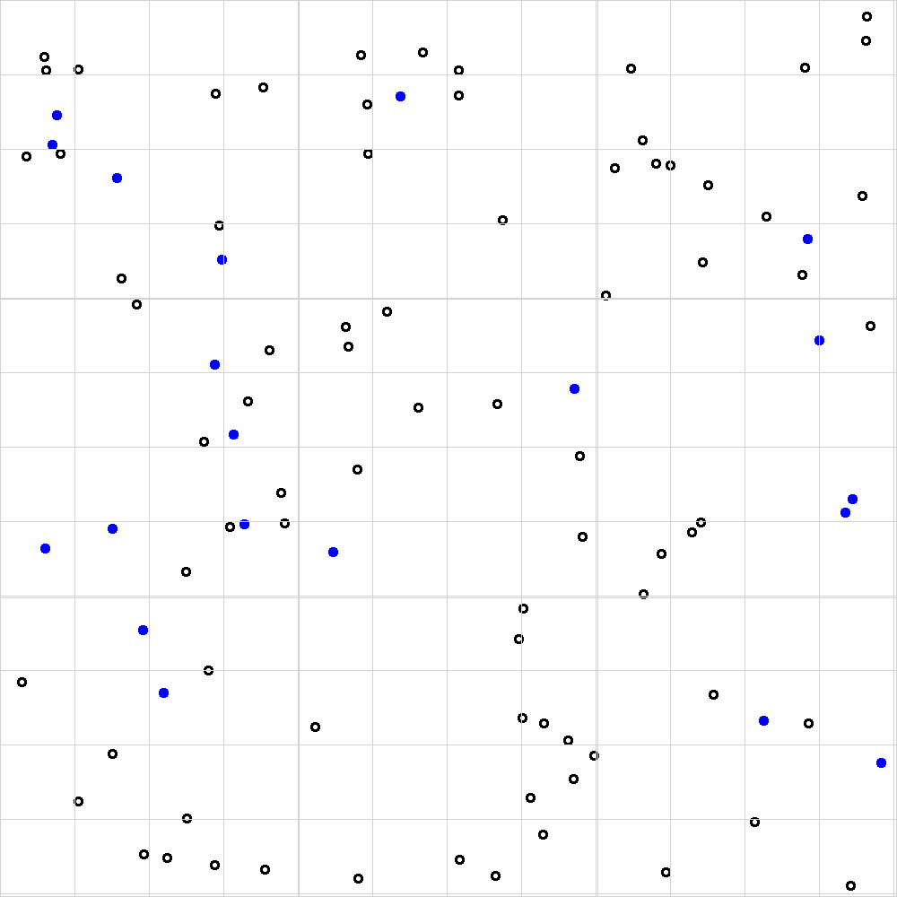

# BIOS103 QS WORKSHEET

## Introduction

## Part 1

The image below represents an image captured by a digital microscope from a hemocytometer prepared with 100 &mu;L of initial cell suspension diluted with 100 &mu;L of Trypan blue.

Each white circle (with a black outline) represents a viable red blood cell. Each blue circle represents a non-viable cell.




### Tasks
1. Following the methodology in this [video](https://youtu.be/pP0xERLUhyc?si=VuGRVFv75Rax0fKF), count the total number of viable cells.
2. Count the total number of non-viable cells.
3. Calculate the percentage of viable cells.
4. Calculate the average number of viable cells per major square.
5. Calculate the concentration of viable cells (cells /  mL)

## Part 2

How long did it take you to calculate the concentration for that single sample? Probably not that long, but, what if you had to measure 1000 samples. Are you going to do that manually? Good luck with that.

Let's use our coding superpowers to automate the task of counting viable cells and calculating the cell concentration for a single sample. Here's a script called [hemo-tools.R](hemo-tools.R) that I prepared earlier. I don't need you to understand this script line for line, just know that it contains a function called `count_objects()`. This function will analyse a hemocytometer slide image and count the number of viable cells for you. You're welcome!

Download and save the file to your R project.

Before you use this script you'll need to make sure that you have the `png` and `EBImage` packages installed. In your [R terminal](/glossary.md#r-terminal), run the following lines:

```
install.packages("png")
install.packages("EBImage")
```

OK. We're ready, let's create a new `count.R` script file in our current R project and import `hemo-tools.R`.

```{R}
# count.R script file

# Import the hemo-tools.R script
source("hemo-tools.R")
```

Download the [hemo.png](hemo.png) file to your R project's directory. Note that this file is the same as the image above but without the grid lines. Now let's use the `count_objects()` function to count the number of viable cells as follows:

```{R}
# count.R script file
...

# Use count_objects() on my hemocytometer_slide_no_grid.png file
result <- count_objects("hemo.png")

# Print the total number of cells
cat("Total number of cells:", result, "\n")
```

After running these lines you should see the the following result in your R Terminal:

```{R}
Total number of cells: 78 
```
In other words, the script has identified 78 viable cells in the full image (i.e. 9 squares).

Let's finish off our `count.R` script by also calcuating the concentration of viable cells. 

```
# count.R script file
...

# Calculate cell concentration
cell_concentration <- result * 2 * 1e4 / 9

# Print the cell concentration in standard form and to 2 decimal places
cat("Cell concentration:", 
    sprintf("%.2e", cell_concentration), 
    "cells/mL\n")
```

After running the full script one last time you should see the following in your terminal:
```
Total number of cells: 78 
Cell concentration: 1.73e+05 cells/mL
```
How does this calculation compare with the one you made manually in [part 1](#part-1) above? Your numbers should be pretty similar, but the value provided by the R script is more accurate. Also, now that you've written the script you can use it over and over again on new images.

# Part 3


