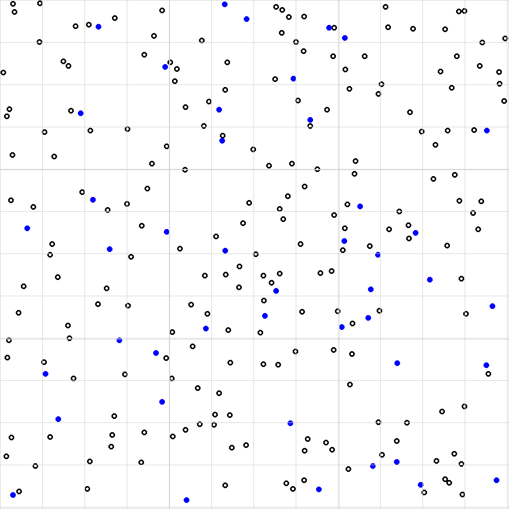

# BIOS103 QS WORKSHEET

## Introduction

## Task 1.

The image below represents an image captured by a digital microscope from a hemocytometer prepared using 100 &mu;L of initial cell suspension diluted with 100 &mu;L of Trypan blue.

Each white circle (with a black outline) represents a viable red blood cell. Each blue circle represents a non-viable cell.

1. Following the methodology in this [video](https://youtu.be/pP0xERLUhyc?si=VuGRVFv75Rax0fKF), count the total number of viable cells.
2. Count the total number of non-viable cells.
3. Calculate the percentage of viable cells.
4. Calculate the average number of viable cells per major square.
5. Calculate the concentration of viable cells (cells /  mL)

